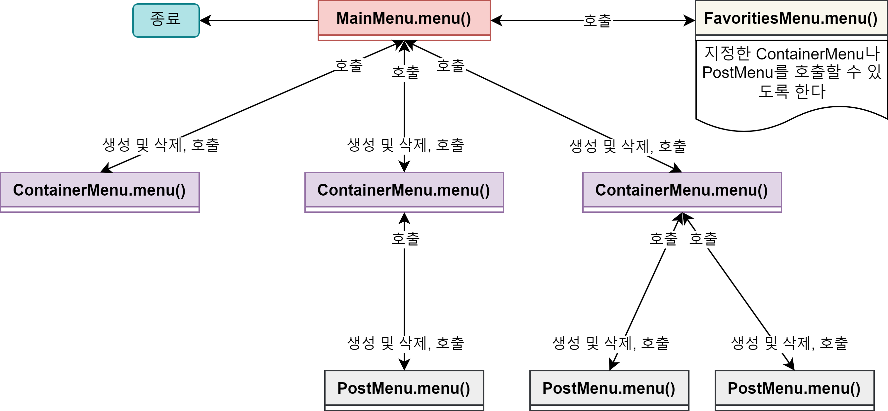
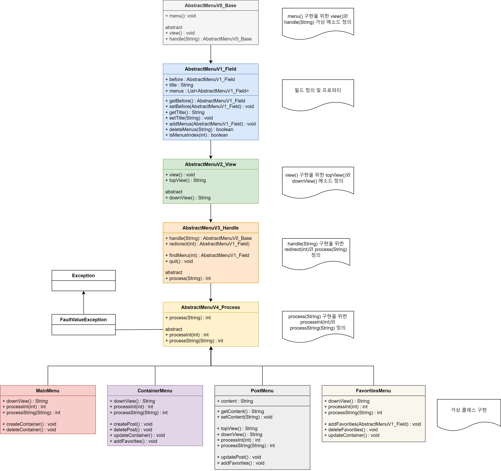
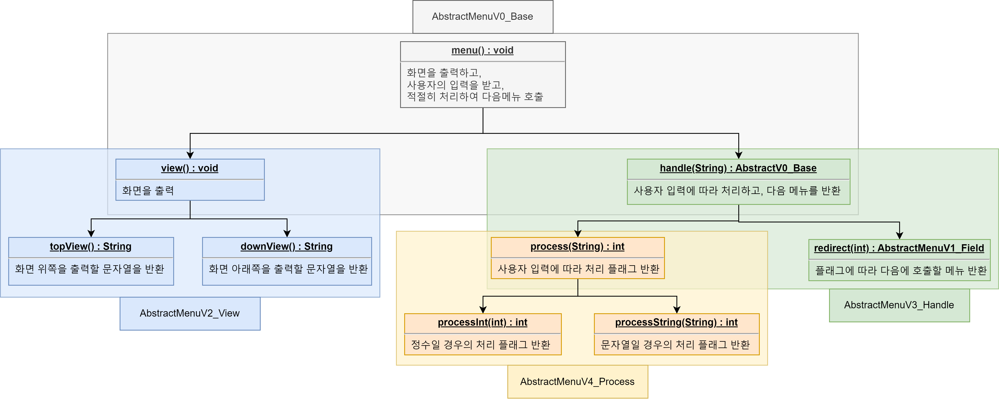
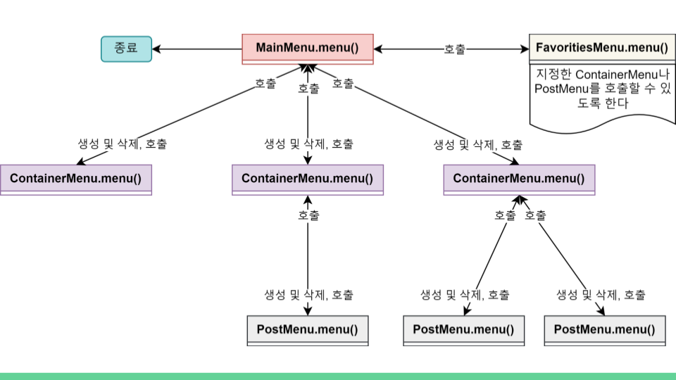
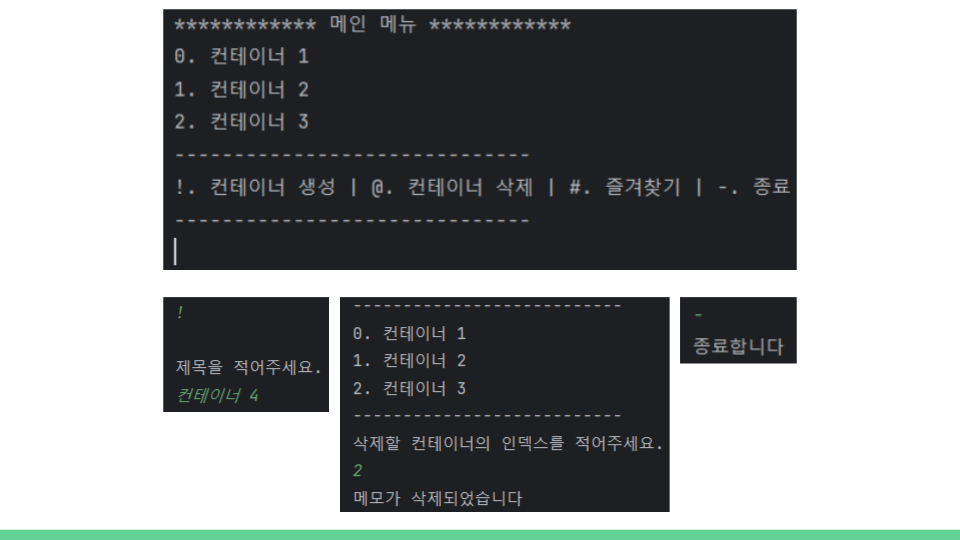
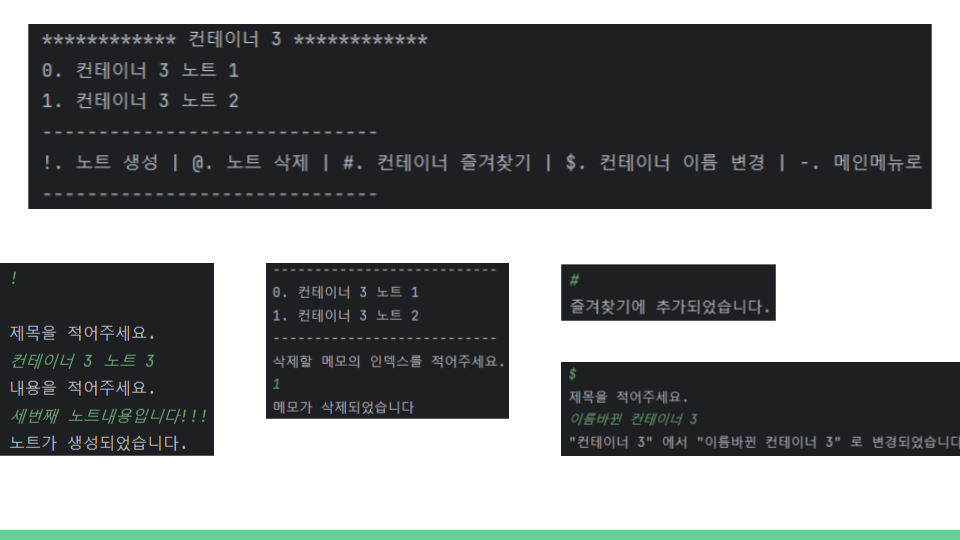
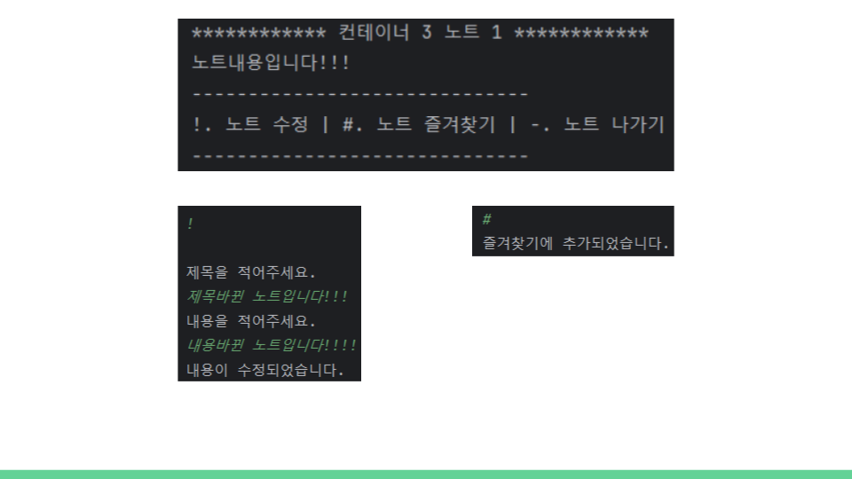
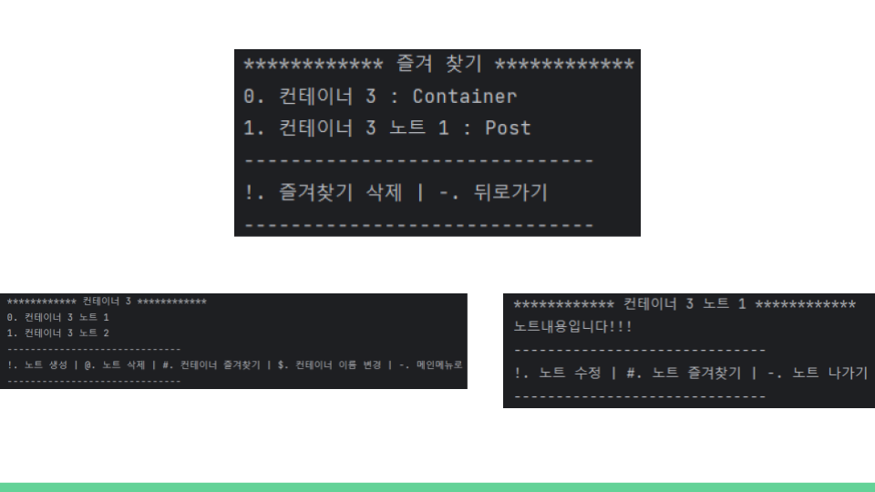
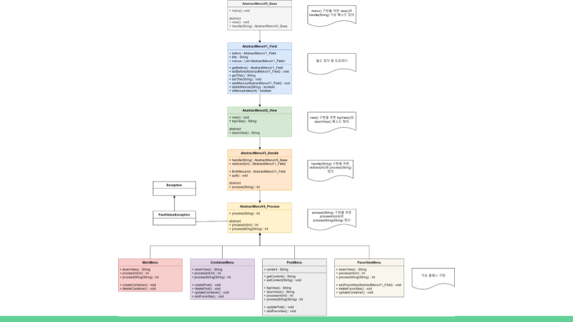
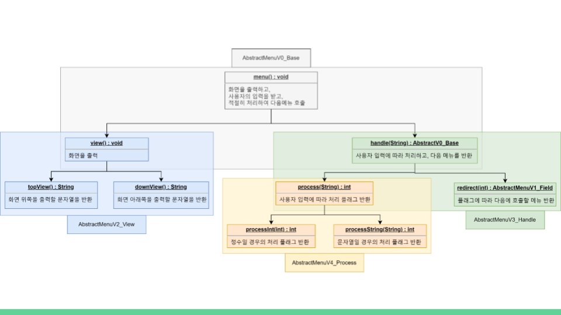

# JavaBasicProject

## **큰 그림**

- ### 서비스 구조

- ### 상속 구조
  

- ### 추상 클래스를 구체화하는 구조

## **프레젠테이션**

### 0. 시작

### 1. 개요

### 2. 서비스 구조

- 메인 메뉴(MainMenu)에서 시작해서 컨테이너(ContainerMenu)를 생성 및 삭제, 호출을 할 수 있도록 하였고, 또한 호출된 저장소 안에서 포스트(PostMenu)를 생성 및 삭제 호출을 할 수 있도록 하였다.

- 즐겨찾기 메뉴(FavoritiesMenu)에서는 컨테이너나 포스트를 등록해놓으면 등록해놓은 개체를 호출할 수 있도록 하였다.

### 3. 메인메뉴

- 처음 시작하면 메인 메뉴가 나오는데 사용자의 입력에 따라 다른 행동을 지시한다. 

- 느낌표(!)를 적으면 컨테이너 생성을 하게 되는 메뉴가 나오고, 골뱅이(@)를 적으면 컨테이너 삭제를 할 수 있는 메뉴가 나온다. 

- 컨테이너를 생성하게 되면 위쪽 메뉴에 인덱스와 함께 제목이 나열된다. 인덱스를 적으면 그 컨테이너가 호출되게 된다.

- 샵(#)을 적으면 즐겨찾기 메뉴로 호출 된다.

- 대쉬(-)를 적으면 프로그램이 종료하게 된다.

### 4. 컨테이너 메뉴

- 느낌표(!)를 적으면 포스트를 생성하는 메뉴가 나오고, 골뱅이(@)를 적으면 포스트를 삭제하는 메뉴가 나온다.

- 샵(#)을 적으면 즐겨찾기에 추가할 수 있다.

- 달러($)를 적으면 컨테이너 이름을 변경할 수 있다. 가장 위쪽의 이름이 바뀐다.

- 대쉬(-)를 적으면 메인 메뉴가 호출된다.

### 5. 포스트 메뉴

- 느낌표(!)를 적으면 노트를 수정할 수 있는 메뉴가 나오고, 제목과 내용을 작성하면 수정된다.

- 샵(#)을 적으면 즐겨찾기에 추가할 수 있다.

### 6. 즐겨찾기 메뉴

- 즐겨찾기 메뉴에서는 기존에 등록한 메뉴를 호출할 수 있다.

- 인덱스로 표시된 숫자를 호출하면 그 메뉴로 이동하게 된다. 호출된 메뉴에서 대쉬(-)로 다시 즐겨찾기 메뉴로 돌아올 수 있다.

- 느낌표(!)를 적으면 즐겨찾기를 삭제할 수 있는 메뉴가 나오며 즐겨찾기 메뉴에서 사라지게 된다. 실제 메뉴는 삭제되지 않는다.

### 7. 클래스 구조

- 상속한 가상 클래스의 메소드를 구체화하여 메뉴에서 공통된 기능을 자동화하는 방식으로 작성되었다.

- AbstractMenuV2 클래스는 멤버변수나 프로퍼티 등를 정의해 놓았다.

- 그 외의 클래스는 상속받은 가상 메소드를 구현한다.

### 8. 가상 메소드 구현

- 각 상속마다 하나의 메소드를 구현하였다.

- 기능을 세분화하여 자동화할 수 있는 부분을 자동화하였고, 다형성이 필요한 부분은 가상 메소드로 남겨놓았다.